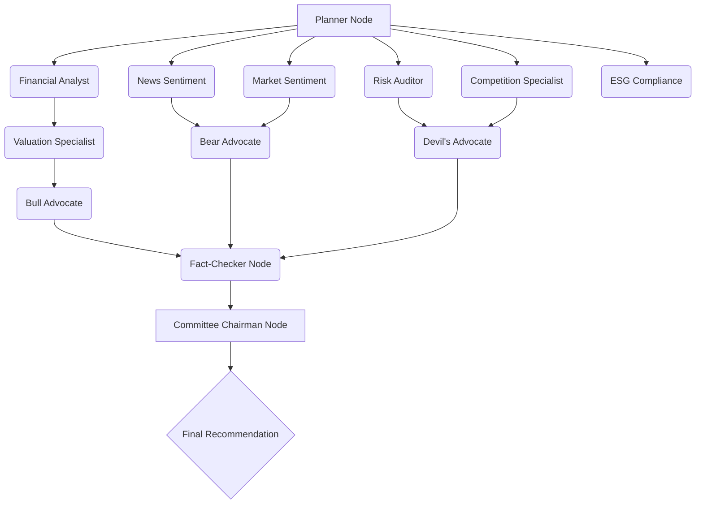

# AlphaBoard AI — System Architecture

This document maps out the multi-agent state graph (DAG) structure that powers the AlphaBoard AI investment research platform.

---

## 1. LangGraph Orchestration Flow (DAG)

AlphaBoard AI implements a 13-node hierarchical state graph. The **Planner Node** acts as the root coordinator, branching tasks to parallel specialist nodes, collecting their states, conducting a debate cycle, and final consensus voting:

---

## 2. State Schema Variables

The state dictionary is mutated as each node completes execution. The core variables passed through the channels include:

| Channel Name | Data Type | Source Node | Description |
|---|---|---|---|
| `company_name` | String | Input / Planner | Active search target |
| `ticker` | String | Input / Planner | Identified trading symbol |
| `dcf_fair_value`| Float | Valuation | Intrinsic value per share |
| `news_bias` | Float | News Sentiment | Sentiment weight score (-1.0 to +1.0) |
| `risk_level` | String | Risk Auditor | Assigned threat level (Low, Med, High) |
| `votes_matrix` | Object | All Specialist Nodes | Consolidated Buy/Hold/Sell counts |
| `final_memo` | String | Committee Chairman | Executive summary statement |

---

## 3. Print Stylesheet System
To facilitate offline reporting, [index.css](file:///d:/iim%20assignment/src/index.css) embeds a `@media print` query that strips glowing neon tabs, sidebars, interactive sliders, and search tools, reformatting the dashboard into a high-density, double-column monochrome report suitable for corporate PDF export.
